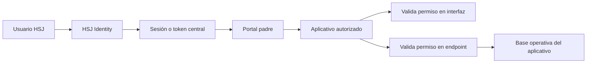

# Arquitectura central de identidad e integración de aplicaciones HSJ

## Decisión institucional

`HSJ_Identity` es la única fuente de verdad para usuarios, cuentas de acceso,
aplicaciones, roles y permisos. Ningún aplicativo hijo debe crear su propia
tabla de usuarios, solicitar un segundo inicio de sesión ni mantener
contraseñas locales.

Las bases de datos de cada aplicativo conservan únicamente datos operativos de
su dominio. Por ejemplo, Cirugías administra registros quirúrgicos e
importaciones, pero no administra cuentas.

## Modelo de autorización

La autorización se compone de cuatro elementos centrales:

1. **Aplicación:** sistema registrado, por ejemplo `intranet_hsj`.
2. **Permiso:** capacidad atómica con nombre estable, por ejemplo
   `cirugias.reports.view`.
3. **Rol o perfil:** agrupación reutilizable de permisos dentro de una
   aplicación.
4. **Cuenta:** usuario central al que se asignan uno o más perfiles.

Los aplicativos consultan los permisos efectivos de la sesión. Nunca deben
inferir privilegios a partir del nombre, correo, cargo o una tabla local.

## Autoservicio de registro institucional

El Intranet permite crear una cuenta únicamente después de validar un DNI de
ocho dígitos contra una persona activa de `HSJ_Identity.people` cuyo tipo de
documento sea `DNI`. El flujo no crea personas ni legajos: consume la identidad
previamente registrada y, cuando existe, enlaza también el
`personnel_record` activo más reciente.

La creación se ejecuta en una única transacción sobre `HSJ_Identity`:

1. vuelve a validar la persona y comprueba que no tenga una cuenta;
2. crea el registro compatible en `users`;
3. crea `access_accounts` usando el DNI como `username`;
4. asigna exclusivamente el rol `consulta` de `intranet_hsj`;
5. inicia la sesión y deja pendiente la aceptación de las instrucciones;
6. registra la aceptación en
   `access_accounts.registration_instructions_acknowledged_at`.

La contraseña inicial se calcula como `DDMMAAAA` de la fecha de nacimiento más
los últimos cuatro dígitos del DNI. Por ejemplo, para una fecha `05/03/1990` y
el DNI `12345678`, la contraseña inicial es `050319905678`. El usuario y la
contraseña se muestran en la pantalla de activación. La navegación y las APIs
permanecen bloqueadas hasta que la persona confirme que leyó y guardó esta
información.

El rol inicial permite ingresar al panel y consultar información institucional.
Los permisos adicionales no se autoasignan: deben solicitarse y ser aprobados
por un administrador desde la gestión central de perfiles.

La validación y la creación tienen límites por dirección IP, la validación
vence en diez minutos y el nombre retornado antes del alta se muestra
enmascarado.

### DNI todavía no registrado

Si el DNI no existe en `people`, el autoservicio permite enviar una solicitud
con todos los datos básicos obligatorios: nombres, apellidos paterno y materno,
fecha de nacimiento, correo y teléfono. En una sola transacción se crean:

- la persona con `status = pending` y `data_origin = self_registration`;
- el usuario compatible con `activo = false`;
- la cuenta central con `status = pending`;
- la asignación inicial del rol `consulta`, todavía sin acceso efectivo.

La solicitud no inicia sesión ni permite ingresar a las áreas. El usuario
recibe su identificador y contraseña inicial, pero debe esperar la revisión.
Cuando intenta iniciar sesión con credenciales correctas, el sistema informa
que la aprobación continúa pendiente.

El panel administrativo distingue estas solicitudes de las cuentas inactivas,
muestra nombre, DNI, correo y teléfono y ofrece la acción **Revisar y
aprobar**. La aprobación activa conjuntamente `people`, `users` y
`access_accounts`, y registra `approved_at` y `approved_by`. En el primer
ingreso posterior, el usuario todavía debe confirmar que leyó las instrucciones
de su cuenta antes de navegar.

## Flujo de acceso

La interfaz oculta acciones no autorizadas para ofrecer una experiencia
coherente. El endpoint vuelve a validar el permiso para impedir que una
petición manual omita el control visual.

## Permisos de Cirugías

| Permiso | Capacidad |
| --- | --- |
| `cirugias.view` | Ingresar al módulo y consultar registros básicos |
| `cirugias.analytics.view` | Consultar análisis e indicadores |
| `cirugias.reports.view` | Consultar y exportar reportes |
| `cirugias.records.manage` | Crear y actualizar registros manualmente |
| `cirugias.imports.manage` | Importar Excel y ejecutar eliminaciones masivas |
| `cirugias.staff.manage` | Mantener el personal médico y asistencial |

La matriz inicial reutiliza el perfil central `cirugias` para consulta,
análisis y reportes. Se incorpora `gestor_cirugias` para la operación completa
y `administrador` conserva todas las capacidades.

| Perfil central | Alcance inicial |
| --- | --- |
| `cirugias` | Consulta, análisis y reportes |
| `gestor_cirugias` | Registros, importaciones, personal, análisis y reportes |
| `administrador` | Acceso completo y administración central |

El módulo no contiene un CRUD propio de cuentas. Los cambios posteriores a
esta matriz se realizan en `HSJ_Identity`, no en la base operativa de Cirugías.

## Estándar para aplicaciones nuevas

Cada aplicación nueva, independientemente de que use Laravel, otro framework o
un lenguaje diferente, debe cumplir este contrato:

1. Registrar la aplicación en `HSJ_Identity`.
2. Reutilizar la autenticación central.
3. Declarar permisos atómicos con el prefijo de la aplicación o módulo.
4. Reutilizar roles existentes cuando representen la misma responsabilidad.
5. Crear un rol central nuevo solo cuando ninguna combinación existente
   represente la función requerida.
6. Proteger navegación, componentes y endpoints con los mismos permisos.
7. Guardar en su base propia únicamente información operativa.
8. Proporcionar una ruta visible para volver al portal padre.
9. No crear usuarios, contraseñas, roles ni permisos en la base local.
10. Documentar permisos, integraciones, dependencias y comportamiento ante
    desconexiones.

## Integración recomendada

El objetivo para aplicaciones desacopladas es consumir una API de identidad o
un proveedor compatible con OAuth 2.0/OpenID Connect. Esto permite integrar
Laravel, .NET, Java, Python, Node.js u otras tecnologías sin compartir acceso
directo a las tablas.

La lectura directa de `HSJ_Identity` utilizada actualmente por la Intranet es
una integración transitoria dentro del mismo entorno Laravel. No debe
convertirse en el contrato público para futuros aplicativos.

Un token o respuesta de sesión deberá incluir como mínimo:

- identificador inmutable de la cuenta;
- aplicación destino;
- roles efectivos;
- permisos efectivos;
- vigencia y mecanismo de renovación;
- identificador de sesión para auditoría.

## Alta de capacidades nuevas

Cuando una funcionalidad no tiene permiso central:

1. Se registra un permiso atómico en la aplicación correspondiente.
2. Se documenta qué acción protege.
3. Se asigna a los perfiles centrales que lo necesitan.
4. Se implementa la validación tanto en interfaz como en servidor.
5. Se agregan pruebas para acceso permitido y denegado.

No se crea un nuevo usuario ni un rol duplicado para resolver una capacidad
faltante.
