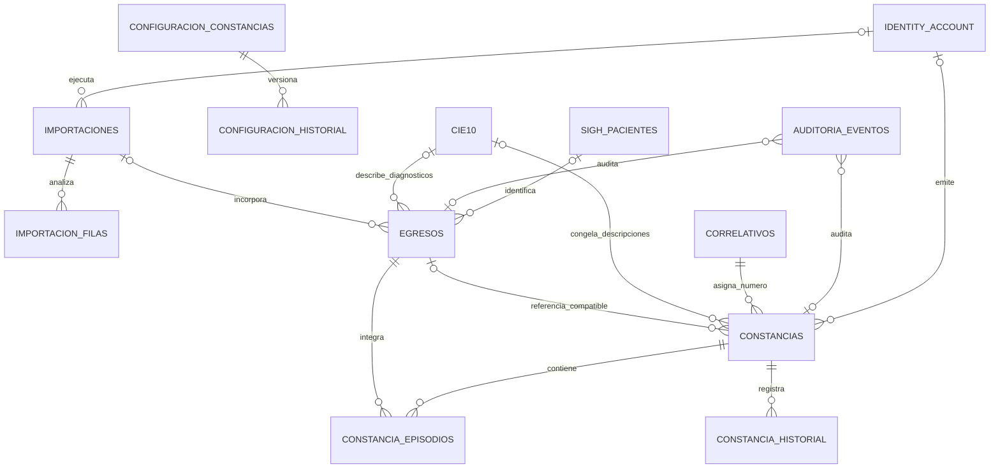

# Diccionario funcional y técnico de datos de Egresos

Fecha de actualización: 25 de julio de 2026.

## 1. Alcance

Este documento describe las tablas que participan en el módulo Egresos del
Intranet HSJ, el propósito funcional de cada campo, sus relaciones y el lugar
en el que actualmente se utiliza.

Incluye:

- el esquema operativo `egresos`;
- el catálogo CIE-10 de `catalogos`;
- la auditoría compartida de `auditoria`;
- las tablas temporales de conciliación de `staging`.

No describe las tablas propias de Cirugías ni las tablas internas de
`HSJ_Identity`. Los campos que terminan en `_account_id`, `_person_id` o
`_personnel_record_id` apuntan lógicamente a esa base central, pero no tienen
una clave foránea física porque se encuentran en bases separadas.

## 2. Convenciones

| Marca | Significado |
| --- | --- |
| PK | Clave primaria física |
| FK | Clave foránea física dentro de `Intranet_HSJ` |
| RL | Relación lógica con otra base, principalmente `HSJ_Identity` o SIGH |
| Activo | Se lee o escribe desde el módulo Laravel actual |
| Importación | Se utiliza al importar, conciliar o validar datos |
| Histórico | Se conserva como evidencia del origen, aunque no se edite en la interfaz |

Campos comunes:

| Campo | Función |
| --- | --- |
| `id` | Identificador interno autoincremental de la fila. |
| `created_at` | Fecha en que Laravel creó la fila en `Intranet_HSJ`. |
| `updated_at` | Última modificación realizada por Laravel. |
| `source_system` | Sistema que originó el dato, por ejemplo `egresos_legacy`, `intranet_hsj` o `sigh_202607_local`. |
| `source_id` | Identificador que la fila tenía en el sistema de origen. Junto con `source_system` permite importar sin duplicar. |
| `source_fingerprint` | Huella SHA-256 del contenido procedente del origen; permite detectar cambios o repeticiones. |
| `source_created_at` | Fecha de creación informada por el sistema de origen. |
| `source_updated_at` | Fecha de actualización informada por el sistema de origen. |
| `imported_at` | Fecha en que el dato fue incorporado a `Intranet_HSJ`; se usa para mostrar las cargas más recientes. |

## 3. Mapa de relaciones

Las uniones con CIE-10, `HSJ_Identity` y SIGH son relaciones lógicas. Las
relaciones físicas se detallan en cada tabla.

## 4. `catalogos.cie10`

Catálogo maestro de diagnósticos. Se importa antes de los egresos y se utiliza
para validar códigos, mostrar descripciones en consulta y congelar la
descripción en una constancia.

Usado por:

- `EgresoController` en consulta, detalle y línea de tiempo;
- `ConstanciaController` al generar o editar una constancia;
- `SaveEgresoRequest` y `EgresoImportService` para validar diagnósticos;
- `ImportLegacyEgresos` y `ValidateLegacyEgresos`.

| Campo | Función y relación |
| --- | --- |
| `id` | PK interna del diagnóstico. |
| `source_system` | Origen del catálogo. Histórico e importación. |
| `source_id` | ID del diagnóstico en el origen; único por sistema cuando existe. |
| `codigo` | Código CIE-10 conservado con el formato recibido. Se muestra al usuario. |
| `codigo_normalizado` | Código en mayúsculas y sin puntos. Es único y es la clave lógica usada por `coddiag1` a `coddiag4`. |
| `descripcion` | Nombre oficial del diagnóstico mostrado en líneas de tiempo, formularios y constancias. |
| `estado` | Estado heredado del diagnóstico; permite conservar si estaba activo o inactivo en el origen. |
| `cotejo_sexo` | Restricción o referencia heredada para comprobar compatibilidad del diagnóstico con el sexo. Aún no bloquea operaciones en la UI. |
| `source_fingerprint` | Huella del registro importado. |
| `source_created_at` | Creación en el origen. |
| `source_updated_at` | Modificación en el origen. |
| `imported_at` | Incorporación al Intranet. |
| `created_at`, `updated_at` | Trazabilidad técnica Laravel. |

## 5. `egresos.importaciones`

Cabecera de cada archivo procesado desde la interfaz o mediante migración.
Separa el análisis de la confirmación para evitar inserciones masivas sin
revisión.

Relaciones:

- `egresos.importaciones.id` → `egresos.importacion_filas.importacion_id`
  con borrado en cascada;
- `egresos.importaciones.id` → `egresos.egresos.importacion_id`, que queda
  nulo si se elimina la cabecera;
- `actor_account_id` y `actor_person_id` son RL con `HSJ_Identity`.

Usado por `ImportacionController`, `EgresoImportService`, la pestaña
Importaciones y el comando `ImportLegacyEgresos`.

| Campo | Función y relación |
| --- | --- |
| `id` | PK del lote. |
| `source_system` | Origen del lote o proceso que lo creó. |
| `source_id` | ID de la importación en el aplicativo legado, si existía. |
| `archivo` | Nombre original del CSV, XLSX, DBF o respaldo procesado. |
| `actor_account_id` | RL con la cuenta central que ejecutó la carga. |
| `actor_person_id` | RL con la persona central asociada al ejecutor. Preparado para conciliación futura. |
| `actor_username` | Correo o usuario central copiado para conservar evidencia aunque la cuenta cambie. |
| `actor_display_name` | Nombre visible del ejecutor congelado al momento del proceso. |
| `insertados` | Cantidad final de episodios incorporados. |
| `omitidos` | Cantidad de filas que no se insertaron, por ejemplo duplicados. |
| `errores` | Cantidad de filas con error u observación bloqueante. |
| `detalle` | JSON con resumen por estado, mensajes de fuente y resultados del análisis. |
| `file_sha256` | Huella SHA-256 del archivo completo para reconocer una carga repetida. |
| `estado` | `pending`, `running`, `completed`, `failed` o `rolled_back`. Controla si puede confirmarse y cómo se muestra. |
| `source_created_at` | Fecha original de la importación legada. |
| `started_at` | Inicio efectivo del análisis o importación. |
| `finished_at` | Finalización del proceso. |
| `created_at`, `updated_at` | Trazabilidad técnica Laravel. |

## 6. `egresos.importacion_filas`

Área persistente de análisis por fila. Permite explicar al operador qué dato
es nuevo, reingreso, duplicado o inválido antes de insertar.

Relaciones físicas:

- `importacion_id` → `egresos.importaciones.id`;
- `existing_egreso_id` → `egresos.egresos.id`;
- `imported_egreso_id` → `egresos.egresos.id`.

Usado por `EgresoImportService`, `ImportacionController` y la sección
**Análisis del lote**.

| Campo | Función y relación |
| --- | --- |
| `id` | PK de la fila analizada. |
| `importacion_id` | FK al lote al que pertenece. |
| `fila` | Número de fila dentro del archivo; es único dentro del lote. |
| `estado` | `nuevo`, `reingreso`, `duplicado`, `observado`, `error` o `insertado`. Determina si la fila puede confirmarse. |
| `paciente_clave` | Identidad normalizada usada por el analizador para agrupar o comparar pacientes. |
| `numhc` | HC encontrada en la fila; sirve para conciliación y visualización. |
| `doc_iden` | Documento encontrado o normalizado durante el análisis. |
| `patient_source_id` | RL con `SIGH.dbo.Pacientes.IdPaciente` cuando pudo identificarse al paciente. |
| `existing_egreso_id` | FK al episodio que provocó la clasificación como duplicado o referencia previa. |
| `imported_egreso_id` | FK al nuevo episodio creado al confirmar la fila. |
| `datos` | JSON con todos los valores normalizados que se insertarían. |
| `mensajes` | JSON con advertencias y errores explicados al operador. |
| `created_at`, `updated_at` | Creación y modificación del análisis. |

## 7. `egresos.egresos`

Tabla operativa principal. Cada fila representa un episodio de
hospitalización, no una persona. Una misma HC puede aparecer varias veces si
el paciente tuvo ingresos distintos.

Relaciones:

- `importacion_id` → `egresos.importaciones.id`;
- `egresos.constancias.egreso_id` → `egresos.egresos.id`;
- `patient_source_id` es RL con `SIGH.dbo.Pacientes.IdPaciente`;
- `coddiag1` a `coddiag4` son RL con `catalogos.cie10.codigo_normalizado`.

Usado por:

- consulta de los últimos egresos y línea de tiempo;
- indicadores, estadísticas, reportes CSV/XLSX;
- mantenimiento manual auditado;
- análisis y confirmación de importaciones;
- generación de constancias.

### 7.1 Identidad técnica y origen

| Campo | Función y relación |
| --- | --- |
| `id` | PK del episodio. Es el identificador usado por timeline, corrección y constancias. |
| `source_system` | Sistema que produjo el episodio. |
| `source_id` | ID del episodio en el origen. Puede ser nulo para registros manuales del Intranet. |
| `importacion_id` | FK opcional al lote que insertó el episodio. |
| `source_fingerprint` | Huella del registro completo recibido del origen. |
| `episode_fingerprint` | Huella funcional de identidad, fechas y servicio; se usa para detectar duplicados del mismo episodio. |
| `source_created_at` | Fecha de creación del episodio en el origen, cuando se conoce. |
| `imported_at` | Fecha de incorporación. Ordena **Últimos egresos cargados**. |
| `created_at`, `updated_at` | Fechas técnicas Laravel. |

### 7.2 Establecimiento y organización territorial

Son campos heredados de la fuente estadística. Se importan y conservan para
reportes o interoperabilidad; actualmente no se editan desde el formulario
manual.

| Campo | Función y relación |
| --- | --- |
| `renipress` | Código RENIPRESS del establecimiento que reportó el egreso. |
| `e_ubig` | Ubigeo del establecimiento. |
| `e_cdpto` | Código de departamento del establecimiento. |
| `e_cprov` | Código de provincia del establecimiento. |
| `e_cdist` | Código de distrito del establecimiento. |
| `cod_disa` | Código heredado de la DISA/DIRESA correspondiente. |
| `cod_red` | Código de la red de salud. |
| `cod_mred` | Código de la microred. |

### 7.3 Identidad del paciente

| Campo | Función y relación |
| --- | --- |
| `numhc` | Historia clínica. Es la identidad primaria para agrupar el timeline y conciliar reingresos. |
| `nomb` | Nombres del paciente. Se consulta, muestra y copia a la constancia. |
| `apell` | Apellidos del paciente. Se consulta, muestra y copia a la constancia. |
| `doc_iden` | Valor heredado original o de compatibilidad. No debe usarse como documento final cuando existe `doc_numero`. |
| `doc_tipo_id` | RL con `SIGH.dbo.Pacientes.IdDocIdentidad`; identifica DNI u otro tipo documental. |
| `doc_numero` | Número de documento limpio, sin el prefijo de tipo. Es el valor mostrado y usado como identidad secundaria. |
| `doc_iden_original` | Valor exacto recibido antes de normalizar; permite auditoría y reversión. |
| `doc_source` | Procedencia de la normalización o verificación del documento. |
| `patient_source_id` | RL con el paciente de SIGH que confirmó la identidad. |
| `document_verified_at` | Fecha de la última confirmación contra SIGH. |
| `etnia` | Código o descripción étnica heredada. Solo importación/conservación. |
| `sexo` | Sexo registrado; se muestra y puede mantenerse manualmente. |
| `edad` | Edad informada para el episodio. |
| `tipoedad` | Unidad de edad heredada, por ejemplo años, meses o días según el catálogo de origen. |
| `ubigeo` | Ubigeo de residencia del paciente. |
| `cdpto` | Departamento de residencia. |
| `cprov` | Provincia de residencia. |
| `cdist` | Distrito de residencia. |

### 7.4 Hospitalización

| Campo | Función y relación |
| --- | --- |
| `fecing` | Fecha de ingreso. Ordena y describe cada episodio del timeline. |
| `fecegr` | Fecha de egreso. Se usa en filtros, estadísticas, reportes y constancias. |
| `totalest` | Total de estancia informado por la fuente. Se conserva para estadística. |
| `ups` | Unidad Productora de Servicios o servicio de hospitalización. Se muestra, filtra, agrupa en reportes y se copia a la constancia. |
| `condicion` | Condición al alta, por ejemplo mejorado. Se muestra y se copia al documento. |
| `financia` | Fuente o modalidad de financiamiento, por ejemplo SIS. Se muestra y se reporta. |
| `estado` | Estado operativo heredado del episodio. Se conserva y puede mantenerse en registros manuales. |
| `fechareg` | Fecha de registro comunicada por la fuente, distinta de `created_at`. |
| `codpsal` | Código heredado del profesional de salud asociado al registro o alta. Se conserva para trazabilidad de fuente. |

### 7.5 Diagnósticos y procedimientos

| Campo | Función y relación |
| --- | --- |
| `coddiag1` | Diagnóstico principal; RL con CIE-10. Obligatorio en carga manual y usado en consulta, reportes y constancia. |
| `coddiag2` | Segundo diagnóstico; RL opcional con CIE-10. |
| `coddiag3` | Tercer diagnóstico; RL opcional con CIE-10. |
| `coddiag4` | Cuarto diagnóstico; RL opcional con CIE-10. |
| `cemorb1` | Primer código heredado de causa externa/morbilidad. Se importa y conserva; no se edita en la UI actual. |
| `cemorb2` | Segundo código heredado de causa externa/morbilidad. |
| `codcpt1` | Primer procedimiento CPT heredado. |
| `codcpt2` | Segundo procedimiento CPT heredado. |
| `codcpt3` | Tercer procedimiento CPT heredado. |
| `codcpt4` | Cuarto procedimiento CPT heredado. |

### 7.6 Oncología, tratamiento y parto

Son valores especializados presentes en el archivo estadístico. Permanecen
disponibles para reportes futuros y para no perder información entregada.

| Campo | Función y relación |
| --- | --- |
| `estadio` | Estadio oncológico informado. |
| `valor_t` | Componente T de la clasificación TNM. |
| `valor_n` | Componente N de la clasificación TNM. |
| `valor_m` | Componente M de la clasificación TNM. |
| `tratamien` | Tratamiento informado en la fuente. |
| `prof_parto` | Código o referencia del profesional que atendió el parto. |
| `fecparto` | Fecha del parto asociado al episodio. |
| `rnvivo` | Cantidad o indicador heredado de recién nacido vivo. |
| `rnmuerto` | Cantidad o indicador heredado de recién nacido fallecido. |

## 8. `egresos.constancias`

Representa el estado vigente de cada Constancia de Hospitalización. Es una
instantánea legal: copia paciente, fechas, diagnósticos y configuración para
que una modificación posterior del egreso o del responsable institucional no
altere el documento ya emitido.

Relaciones:

- `egreso_id` → `egresos.egresos.id`; conserva como referencia compatible el
  primer episodio de la selección;
- la relación legal completa se encuentra en
  `egresos.constancia_episodios`;
- `sequence_owner_key` + `anio` se relacionan lógicamente con
  `egresos.correlativos`;
- `issuer_*`, `cancelled_by_*` y `last_printed_by_*` son RL con
  `HSJ_Identity`;
- `egresos.constancia_historial.constancia_id` → esta tabla.

Usado por `ConstanciaController`, `ConstanciaDocumentPresenter`, historial,
vista previa/impresión, indicadores y exportaciones relacionadas.

### 8.1 Identidad, numeración y emisor

| Campo | Función y relación |
| --- | --- |
| `id` | PK de la constancia. |
| `source_system` | Origen de la constancia. |
| `source_id` | ID legado, si fue migrada. |
| `egreso_id` | FK compatible al primer episodio seleccionado. La lista legal completa se obtiene de `constancia_episodios`. |
| `numero` | Correlativo dentro del año. |
| `anio` | Año legal del correlativo; al cambiar el año la numeración empieza nuevamente. |
| `sequence_owner_key` | Propietario técnico del correlativo. Actualmente siempre `application:egresos`. |
| `preview_token_hash` | Huella única del comprobante de previsualización confirmado; impide reutilizarlo para emitir otra constancia. |
| `issuer_account_id` | RL con la cuenta central que emitió la constancia. |
| `issuer_person_id` | RL con la persona central del emisor; reservado para conciliación completa. |
| `issuer_legacy_user_id` | ID del usuario del aplicativo anterior, conservado en constancias migradas. |
| `issuer_username` | Usuario/correo del emisor congelado como evidencia. |
| `issuer_display_name` | Nombre del emisor congelado. |

### 8.2 Instantánea del paciente y episodio

| Campo | Función y relación |
| --- | --- |
| `numhc` | HC copiada del egreso. Agrupa el historial por paciente. |
| `doc_iden` | Documento limpio mostrado en la constancia. |
| `doc_tipo_id` | Tipo documental copiado desde el egreso/SIGH. |
| `doc_iden_original` | Documento original antes de normalización. |
| `paciente` | Nombre completo usado por el documento. |
| `nombres` | Nombres separados para edición y trazabilidad. |
| `apellidos` | Apellidos separados. |
| `fecing` | Fecha de ingreso que certifica el documento. |
| `fecegr` | Fecha de egreso que certifica el documento. |
| `ups` | UPS copiada del episodio. |
| `servicio` | Texto de servicio imprimible; inicialmente se copia desde `ups` y puede corregirse. |
| `condicion` | Condición al alta. |
| `financia` | Financiamiento del episodio. |

### 8.3 Diagnósticos congelados

| Campo | Función y relación |
| --- | --- |
| `coddiag1` | Código del diagnóstico principal al emitir. |
| `descdiag1` | Descripción CIE-10 congelada del diagnóstico principal. |
| `coddiag2` | Código del segundo diagnóstico. |
| `descdiag2` | Descripción congelada del segundo diagnóstico. |
| `coddiag3` | Código del tercer diagnóstico. |
| `descdiag3` | Descripción congelada del tercer diagnóstico. |
| `coddiag4` | Código del cuarto diagnóstico. |
| `descdiag4` | Descripción congelada del cuarto diagnóstico. |

### 8.4 Configuración institucional congelada

| Campo | Función y relación |
| --- | --- |
| `iniciales_director` | Iniciales del director vigentes al emitir; forman parte del código visible. |
| `iniciales_jefe` | Iniciales del jefe vigentes al emitir. |
| `iniciales_ccp` | Iniciales o código complementario institucional vigente. |
| `sigla_servicio` | Sigla específica del servicio para el documento, cuando corresponde. |
| `nombre_director` | Nombre del director vigente al emitir. |
| `nombre_jefe` | Nombre del jefe vigente al emitir. |
| `cargo_director` | Cargo del director vigente al emitir. |
| `cargo_jefe` | Cargo del jefe vigente al emitir. |
| `configuracion_observacion` | Observación institucional copiada desde la configuración activa. |
| `nombre_pdf` | Nombre de archivo heredado o sugerido para el documento. |
| `observacion` | Observación particular de esta constancia. |

### 8.5 Estado legal, anulación e impresión

| Campo | Función y relación |
| --- | --- |
| `estado` | `generada`, `editada` o `anulada`. Una anulada puede verse, pero no imprimirse nuevamente. |
| `motivo_anulacion` | Justificación obligatoria de la anulación. |
| `cancelled_by_account_id` | RL con la cuenta central que anuló. |
| `cancelled_by_person_id` | RL con la persona central que anuló; preparado para conciliación. |
| `cancelled_by_legacy_user_id` | Usuario legado que anuló una constancia migrada. |
| `cancelled_by_username` | Usuario/correo del anulador congelado. |
| `cancelled_by_display_name` | Nombre visible del anulador. |
| `cancelled_at` | Momento exacto de anulación. |
| `print_count` | Número de autorizaciones de impresión registradas. |
| `first_printed_at` | Primera impresión autorizada. |
| `last_printed_at` | Última impresión autorizada. |
| `last_printed_by_account_id` | RL con la última cuenta que imprimió. |
| `last_printed_by_username` | Usuario/correo de la última impresión. |
| `source_fingerprint` | Huella de la constancia creada o importada. |
| `source_created_at` | Creación en el aplicativo anterior. |
| `source_updated_at` | Última modificación en el aplicativo anterior. |
| `imported_at` | Fecha de migración a `Intranet_HSJ`. |
| `created_at`, `updated_at` | Creación y última edición en Laravel. |

## 9. `egresos.constancia_episodios`

Detalle legal de los episodios incluidos en una constancia. Permite seleccionar
entre uno y diez ingresos del mismo paciente y congela los datos de cada uno
para que cambios posteriores en `egresos.egresos` no modifiquen el documento.

Relaciones físicas:

- `constancia_id` → `egresos.constancias.id` con borrado en cascada;
- `egreso_id` → `egresos.egresos.id` y queda nulo si se elimina el episodio,
  sin perder la instantánea legal.

Usado por `ConstanciaController`, `ConstanciaEpisodeSelection`,
`ConstanciaDocumentPresenter` y la vista imprimible. Las constancias históricas
de un solo egreso fueron incorporadas automáticamente con `posicion = 1`.

| Campo | Función y relación |
| --- | --- |
| `id` | PK del episodio congelado. |
| `constancia_id` | FK a la constancia que contiene el episodio. |
| `egreso_id` | FK opcional al episodio operativo original. |
| `posicion` | Orden cronológico dentro del documento; único por constancia. |
| `source_system` | Sistema que originó el episodio. |
| `numhc` | HC congelada para comprobar identidad y trazabilidad. |
| `doc_tipo_id` | Tipo documental vigente al generar. |
| `doc_iden` | Número de documento vigente al generar. |
| `paciente` | Nombre completo congelado. |
| `nombres` | Nombres separados congelados. |
| `apellidos` | Apellidos separados congelados. |
| `fecing` | Fecha de ingreso del episodio certificado. |
| `fecegr` | Fecha de egreso del episodio certificado. |
| `ups` | Código o nombre UPS del episodio. |
| `servicio` | Nombre imprimible del servicio. |
| `condicion` | Condición al alta de este episodio. |
| `financia` | Financiamiento correspondiente a este episodio. |
| `coddiag1` | Diagnóstico principal congelado. |
| `descdiag1` | Descripción CIE-10 congelada del diagnóstico principal. |
| `coddiag2` | Segundo diagnóstico congelado. |
| `descdiag2` | Descripción congelada del segundo diagnóstico. |
| `coddiag3` | Tercer diagnóstico congelado. |
| `descdiag3` | Descripción congelada del tercer diagnóstico. |
| `coddiag4` | Cuarto diagnóstico congelado. |
| `descdiag4` | Descripción congelada del cuarto diagnóstico. |
| `created_at`, `updated_at` | Fecha de incorporación y actualización técnica. |

## 10. `egresos.constancia_historial`

Bitácora legal especializada de una constancia. No representa el estado
actual; conserva cada transición: generación, edición, anulación,
reactivación heredada o impresión.

Relación física: `constancia_id` → `egresos.constancias.id` con borrado en
cascada.

Usado por `ConstanciaTrace`, migración legada, historial de constancias y
validadores de integridad.

| Campo | Función y relación |
| --- | --- |
| `id` | PK del evento histórico. |
| `source_system` | Sistema que produjo el evento. |
| `source_id` | ID del evento en el origen, si fue migrado. |
| `constancia_id` | FK a la constancia afectada. |
| `accion` | `generar`, `editar`, `anular`, `reactivar` o `imprimir`. |
| `descripcion` | Explicación legible de lo ocurrido. |
| `datos_anteriores` | JSON con el estado previo; nulo al generar. |
| `datos_nuevos` | JSON con el estado resultante. |
| `actor_account_id` | RL con la cuenta central responsable. |
| `actor_person_id` | RL con la persona central responsable. |
| `actor_legacy_user_id` | ID del usuario legado si el evento fue migrado. |
| `actor_username` | Usuario/correo conservado como evidencia. |
| `actor_display_name` | Nombre visible del actor. |
| `ip` | Dirección IP desde la que se realizó la acción. |
| `source_fingerprint` | Huella única del evento importado o generado. |
| `occurred_at` | Fecha real del hecho auditado. |
| `imported_at` | Fecha de incorporación de la evidencia. |
| `created_at`, `updated_at` | Trazabilidad técnica Laravel. |

## 11. `egresos.correlativos`

Controla de forma transaccional el siguiente número de constancia por año.
Evita que dos usuarios obtengan el mismo número.

Relación lógica:

`sequence_owner_key` + `anio` → `egresos.constancias.sequence_owner_key` +
`anio`.

Usado exclusivamente por `AnnualCertificateSequence::next()` y
`AnnualCertificateSequence::peek()`.

| Campo | Función y relación |
| --- | --- |
| `id` | PK del contador anual. |
| `sequence_owner_key` | Identifica al dueño del correlativo; actualmente `application:egresos`. |
| `anio` | Año al que pertenece la numeración. |
| `ultimo_numero` | Último número reservado exitosamente dentro de una transacción. |
| `created_at`, `updated_at` | Creación y último incremento del contador. |

La combinación `sequence_owner_key` + `anio` es única. El 1 de enero de un
nuevo año se crea un contador independiente que comienza en cero y la primera
emisión recibe el número 1.

## 12. `egresos.configuracion_constancias`

Fila única (`id = 1`) con la configuración institucional activa. La pantalla
de Configuración siempre abre un formulario limpio; esta tabla sirve como
fuente para la vista previa y para la próxima constancia que se emita.

Usado por `ConfiguracionConstanciaController` y `ConstanciaController`.

| Campo | Función y relación |
| --- | --- |
| `id` | PK fija con valor 1; identifica la configuración activa. |
| `iniciales_director` | Iniciales actuales del director. |
| `iniciales_jefe` | Iniciales actuales del jefe. |
| `iniciales_ccp` | Iniciales/código complementario actual. |
| `nombre_director` | Nombre vigente del director. |
| `nombre_jefe` | Nombre vigente del jefe. |
| `cargo_director` | Cargo institucional del director. |
| `cargo_jefe` | Cargo institucional del jefe. |
| `observacion` | Texto institucional complementario. |
| `updated_by_account_id` | RL con la cuenta central que activó la versión. |
| `updated_by_username` | Usuario/correo que realizó la última actualización. |
| `source_created_at` | Creación en el origen legado, si aplica. |
| `source_updated_at` | Modificación en el origen legado, si aplica. |
| `created_at`, `updated_at` | Creación y última actualización en Laravel. |

## 13. `egresos.configuracion_constancia_historial`

Registro inmutable de cada versión guardada desde Configuración. Permite saber
qué valores estuvieron activos, cuándo y quién los registró.

`configuracion_id` se relaciona lógicamente con
`egresos.configuracion_constancias.id`; no se aplicó FK para conservar
versiones aunque cambie la fila activa.

Usado por `ConfiguracionConstanciaController` y el listado
**Configuraciones registradas**.

| Campo | Función y relación |
| --- | --- |
| `id` | PK de la versión. |
| `configuracion_id` | Identificador lógico de la configuración activa; actualmente 1. |
| `iniciales_director` | Valor de la versión registrada. |
| `iniciales_jefe` | Valor de la versión registrada. |
| `iniciales_ccp` | Valor de la versión registrada. |
| `nombre_director` | Nombre registrado en esa versión. |
| `nombre_jefe` | Nombre registrado en esa versión. |
| `cargo_director` | Cargo registrado en esa versión. |
| `cargo_jefe` | Cargo registrado en esa versión. |
| `observacion` | Observación de esa versión. |
| `actor_account_id` | RL con la cuenta central que guardó la versión. |
| `actor_username` | Usuario/correo del actor. |
| `actor_display_name` | Nombre visible del actor. |
| `ip` | IP desde la que se registró. |
| `user_agent` | Navegador o cliente usado. |
| `created_at`, `updated_at` | Fecha de registro y actualización técnica. |

## 14. `auditoria.eventos`

Auditoría transversal del Intranet. A diferencia de
`constancia_historial`, puede registrar acciones sobre egresos,
configuraciones, importaciones, conciliaciones y otros módulos futuros.

Usado por `EgresoTrace`, `ConstanciaTrace`, `EgresoImportService`,
`ConfiguracionConstanciaController`, `SyncEgresosPatients` y
`AuditoriaController`.

| Campo | Función y relación |
| --- | --- |
| `id` | PK del evento. |
| `event_uuid` | UUID global único para intercambio o correlación entre sistemas. |
| `application_code` | Aplicación que originó el evento; actualmente `intranet_hsj`. |
| `module` | Módulo funcional, por ejemplo `egresos`. |
| `event_type` | Tipo técnico estable, por ejemplo `record.update` o `certificate.imprimir`. |
| `action` | Acción corta legible, por ejemplo `update`, `generar` o `anular`. |
| `subject_type` | Clase o tipo de entidad afectada. |
| `subject_id` | ID de la entidad afectada; RL polimórfica con egreso, constancia, configuración u otra entidad. |
| `actor_account_id` | RL con la cuenta central responsable. |
| `actor_person_id` | RL con la persona central responsable. |
| `actor_username` | Usuario/correo conservado para evidencia. |
| `actor_display_name` | Nombre visible del actor. |
| `session_uuid` | Identificador de sesión para correlacionar varias acciones, cuando esté disponible. |
| `ip` | IP de origen. |
| `user_agent` | Navegador o cliente. |
| `data_before` | JSON con el estado anterior. |
| `data_after` | JSON con el estado resultante. |
| `metadata` | JSON con contexto adicional, por ejemplo lote, mecanismo o backfill. |
| `occurred_at` | Momento funcional del evento. |
| `created_at`, `updated_at` | Persistencia técnica Laravel. |

## 15. `catalogos.cie10_importaciones`

Cabecera persistente de cada archivo CIE-10 analizado desde la interfaz. No
modifica el catálogo hasta que un usuario autorizado confirma el lote.

| Campo | Función y relación |
| --- | --- |
| `id` | PK y número visible del lote. |
| `archivo` | Nombre original del CSV o XLSX. |
| `file_sha256` | Huella SHA-256 usada para detectar la repetición del mismo archivo. |
| `estado` | `analizado`, `confirmado` o `fallido`. |
| `actor_account_id` | Cuenta central que presentó el archivo. |
| `actor_username` | Usuario/correo conservado como evidencia. |
| `actor_display_name` | Nombre visible del responsable. |
| `nuevos` | Códigos inexistentes y válidos detectados. |
| `actualizaciones` | Códigos existentes cuyos atributos cambiarían. |
| `sin_cambios` | Códigos idénticos al catálogo vigente. |
| `errores` | Filas con formato, valores o duplicidad inválidos. |
| `confirmed_at` | Fecha de aplicación efectiva; nula durante el análisis. |
| `created_at`, `updated_at` | Trazabilidad técnica del lote. |

Relaciones:

- uno a muchos con `catalogos.cie10_importacion_filas`;
- relación lógica con `auditoria.eventos.subject_id`;
- relación lógica con la cuenta de `HSJ_Identity`.

## 16. `catalogos.cie10_importacion_filas`

Resultado reproducible de validar cada fila de un catálogo masivo.

| Campo | Función y relación |
| --- | --- |
| `id` | PK técnica. |
| `importacion_id` | FK con `catalogos.cie10_importaciones`; se elimina en cascada. |
| `fila` | Número original de fila del archivo. |
| `estado` | `nuevo`, `actualizar`, `sin_cambios`, `error`, `insertado` o `actualizado`. |
| `cie10_id` | FK opcional al código existente o aplicado. |
| `codigo` | Código con formato visible. |
| `codigo_normalizado` | Código sin separadores, usado para detectar equivalencias y duplicados. |
| `datos` | JSON con código, descripción, estado y cotejo de sexo propuestos. |
| `datos_anteriores` | Instantánea JSON y versión previa para impedir sobrescrituras concurrentes. |
| `mensajes` | Explicación JSON de errores u observaciones. |
| `created_at`, `updated_at` | Trazabilidad técnica. |

Un lote con errores no puede confirmarse. Durante la confirmación se vuelve a
comprobar la versión de cada registro; si otro usuario lo modificó después del
análisis, toda la transacción se rechaza.

## 17. Tablas `staging`

Estas tablas no son maestras ni operativas. Son áreas temporales y auditables
para migrar datos sin crear automáticamente usuarios o vínculos incorrectos.

### 15.1 `staging.identity_user_map`

Concilia usuarios de aplicativos antiguos con cuentas y personas centrales.

Usado por `ReconcileLegacyIdentities`, `ImportLegacyEgresos` e
`ImportLegacyCirugias`.

| Campo | Función y relación |
| --- | --- |
| `id` | PK del cruce propuesto. |
| `source_system` | Aplicativo de procedencia. |
| `source_table` | Tabla de usuarios de procedencia. |
| `source_user_id` | ID del usuario en esa tabla. |
| `source_username` | Usuario o correo encontrado en el origen. |
| `identity_account_id` | RL con la cuenta de `HSJ_Identity`. |
| `identity_person_id` | RL con la persona de `HSJ_Identity`. |
| `match_method` | Método de coincidencia, por ejemplo correo, documento o revisión manual. |
| `review_status` | `pending`, `matched`, `ambiguous` o `rejected`. |
| `notes` | Explicación de coincidencias dudosas o decisiones. |
| `reviewed_by_account_id` | RL con la cuenta central que revisó el cruce. |
| `reviewed_at` | Fecha de revisión. |
| `created_at`, `updated_at` | Trazabilidad técnica. |

### 15.2 `staging.personnel_map`

Concilia personal legado con personas, legajos y asignaciones de
`HSJ_Identity`.

Usado por `ReconcileLegacyIdentities` e `ImportLegacyCirugias`. Está preparado
para la futura integración de Legajos.

| Campo | Función y relación |
| --- | --- |
| `id` | PK del cruce propuesto. |
| `source_system` | Sistema de procedencia. |
| `source_table` | Tabla de personal de procedencia. |
| `source_personnel_id` | ID del personal en el origen. |
| `source_document_number` | Documento encontrado en el origen. |
| `source_display_name` | Nombre del personal en el origen. |
| `identity_person_id` | RL con la persona central. |
| `identity_personnel_record_id` | RL con el legajo central `personnel_records`. |
| `identity_assignment_id` | RL con la asignación laboral central. |
| `match_method` | Método utilizado para proponer el cruce. |
| `review_status` | `pending`, `matched`, `ambiguous` o `rejected`. |
| `notes` | Observaciones de conciliación. |
| `reviewed_by_account_id` | RL con la cuenta revisora. |
| `reviewed_at` | Momento de revisión. |
| `created_at`, `updated_at` | Trazabilidad técnica. |

### 15.3 `staging.import_runs`

Bitácora técnica de ejecuciones de los importadores de migración. No sustituye
a `egresos.importaciones`, que corresponde a la carga operativa visible del
módulo.

Usado por `ImportLegacyEgresos` e `ImportLegacyCirugias`.

| Campo | Función y relación |
| --- | --- |
| `id` | PK de la ejecución. |
| `run_uuid` | UUID único del proceso. |
| `source_system` | Sistema migrado. |
| `source_file_name` | Nombre del respaldo o archivo fuente. |
| `source_file_sha256` | Huella del archivo para reproducibilidad. |
| `entity` | Entidad procesada, por ejemplo CIE-10, egresos o constancias. |
| `status` | `pending`, `running`, `completed`, `failed` o `rolled_back`. |
| `dry_run` | Indica que se validó sin confirmar cambios. |
| `source_count` | Total de filas encontradas en el origen. |
| `inserted_count` | Filas insertadas. |
| `updated_count` | Filas actualizadas. |
| `skipped_count` | Filas omitidas. |
| `error_count` | Errores detectados. |
| `validation_summary` | JSON con conteos, relaciones y huellas verificadas. |
| `started_at` | Inicio de la ejecución. |
| `finished_at` | Finalización. |
| `executed_by_account_id` | RL con la cuenta central que ejecutó el comando. |
| `created_at`, `updated_at` | Trazabilidad técnica. |

## 18. Matriz de uso por función

| Función | Tablas principales |
| --- | --- |
| Últimos egresos | `egresos.egresos`, `catalogos.cie10` |
| Timeline del paciente | `egresos.egresos`, `catalogos.cie10` |
| Registro/corrección manual | `egresos.egresos`, `catalogos.cie10`, `auditoria.eventos` |
| Análisis de archivo | `egresos.importaciones`, `egresos.importacion_filas`, `catalogos.cie10`, lectura SIGH |
| Confirmación de carga | `egresos.importacion_filas`, `egresos.egresos`, `egresos.importaciones`, `auditoria.eventos` |
| Previsualización de constancia | `egresos.egresos`, `catalogos.cie10`, `egresos.configuracion_constancias`, lectura de `egresos.correlativos` sin reservar |
| Generación de constancia | `egresos.egresos`, `catalogos.cie10`, `egresos.configuracion_constancias`, `egresos.correlativos`, `egresos.constancias`, `egresos.constancia_episodios`, `egresos.constancia_historial`, `auditoria.eventos` |
| Edición/anulación/impresión | `egresos.constancias`, `egresos.constancia_historial`, `auditoria.eventos` |
| Configuración institucional | `egresos.configuracion_constancias`, `egresos.configuracion_constancia_historial`, `auditoria.eventos` |
| CRUD CIE-10 | `catalogos.cie10`, `auditoria.eventos` |
| Análisis masivo CIE-10 | `catalogos.cie10_importaciones`, `catalogos.cie10_importacion_filas`, `catalogos.cie10` |
| Confirmación masiva CIE-10 | `catalogos.cie10_importaciones`, `catalogos.cie10_importacion_filas`, `catalogos.cie10`, `auditoria.eventos` |
| Consulta funcional de auditoría | `auditoria.eventos`; presenta resúmenes y etiquetas operativas, conservando IDs y códigos en información técnica |
| Reportes y exportaciones | `egresos.egresos`, `catalogos.cie10` |
| Migración inicial | tablas `staging`, `catalogos.cie10` y tablas del esquema `egresos` |

## 19. Reglas de integridad importantes

1. Una fila de `egresos.egresos` es un episodio, no un paciente.
2. La HC agrupa episodios; el documento se usa como alternativa cuando no hay
   HC.
3. Un reingreso no es duplicado si cambian las fechas o el servicio.
4. Una constancia admite entre uno y diez episodios, todos pertenecientes al
   mismo paciente.
5. La vista preliminar no reserva correlativo ni inserta una constancia; emite
   un comprobante cifrado de confirmación válido por 15 minutos y de un solo
   uso.
6. La constancia conserva `egreso_id` por compatibilidad y registra la
   selección completa en `constancia_episodios`.
7. La constancia y sus episodios copian los datos necesarios para preservar el
   documento histórico.
8. El correlativo es único por aplicación y año y solo se reserva al confirmar.
9. Una constancia anulada permanece consultable, pero no puede reimprimirse.
10. Toda emisión, edición, anulación e impresión genera historial especializado
   y auditoría transversal.
11. Una constancia múltiple no se edita parcialmente; se anula y se genera
    nuevamente con la selección correcta.
12. Los IDs de `HSJ_Identity` se conservan junto con el nombre del actor; esto
   mantiene evidencia incluso si el perfil central cambia.
13. Las tablas `staging` no conceden accesos ni crean cuentas por sí solas.
14. Un código CIE-10 no se elimina físicamente: se marca `INACTIVO` para
    conservar diagnósticos y documentos históricos.
15. La carga masiva CIE-10 siempre requiere análisis y confirmación separados;
    una huella de archivo repetida o cualquier fila con error bloquea su
    aplicación.

## 20. Código fuente de referencia

- Migraciones: `database/migrations/2026_07_25_190000` a
  `2026_07_25_210000`.
- Modelos: `app/Models/Egresos`.
- Consulta y timeline: `app/Http/Controllers/Egresos/EgresoController.php`.
- Constancias: `app/Http/Controllers/Egresos/ConstanciaController.php`.
- Selección y congelamiento de episodios:
  `app/Services/Egresos/ConstanciaEpisodeSelection.php`.
- Configuración:
  `app/Http/Controllers/Egresos/ConfiguracionConstanciaController.php`.
- Importaciones: `app/Services/Egresos/EgresoImportService.php`.
- Catálogo CIE-10: `app/Services/Egresos/Cie10CatalogService.php` y
  `app/Http/Controllers/Egresos/Cie10CatalogController.php`.
- Correlativo: `app/Services/Egresos/AnnualCertificateSequence.php`.
- Auditoría: `app/Services/Egresos/EgresoTrace.php` y
  `app/Services/Egresos/ConstanciaTrace.php`; CIE-10 usa
  `app/Services/Egresos/Cie10Trace.php`.
