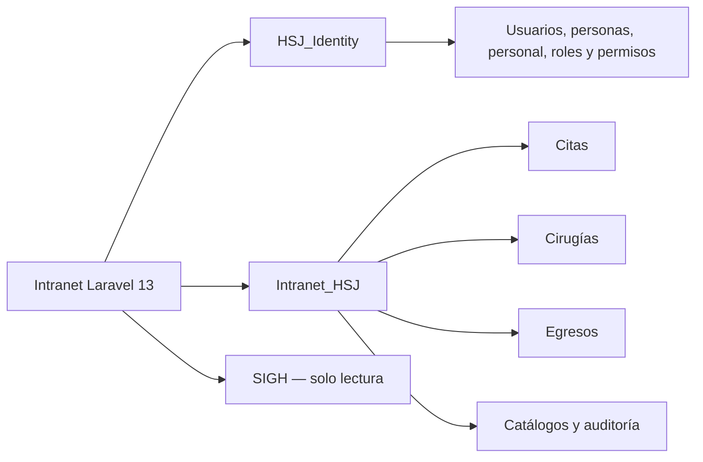

# Plan de consolidación de Egresos y Cirugías

## Estado del documento

- Estado: implementación en curso.
- Plan inicial publicado en el commit `54566fe`.
- Fases 1 y 2 aplicadas el 25 de julio de 2026.
- Operación funcional de Egresos completada el 25 de julio de 2026:
  registro excepcional, corrección auditada, importación desde interfaz,
  reportes y exportaciones.
- Documentos de pacientes normalizados y conciliados contra
  `SIGH_202607_LOCAL.dbo.Pacientes`, conservando el dato histórico original.
- Base operativa destino: `Intranet_HSJ`.
- Base central de identidad: `HSJ_Identity`.
- Fuente clínica externa: SIGH, exclusivamente de lectura.

Este documento es el contrato técnico para migrar los datos entregados de
Egresos y Cirugías al Intranet Laravel 13. Cada ejecución deberá quedar
respaldada por migraciones, comandos repetibles, validaciones y evidencia en
Git.

## Fuentes verificadas

Los respaldos contienen información personal y hashes de contraseña. No deben
incorporarse al repositorio.

| Fuente | Motor | Base original | SHA-256 |
| --- | --- | --- | --- |
| `egresos_BD.sql` | MySQL | `bd_cis_egresos` | `8C23AE92C4E706C07514D23C87AB258043F1363D071CAE1B8CF0D10501E5934D` |
| `HSJ_DATA.sql` | MySQL | `hospital_ueei` | `2D663F528F21E236DC7EDBB9FB7521761081FF8F63A59191681864E02E66C8C6` |

Conteos base que deben conservarse:

| Entidad | Conteo esperado |
| --- | ---: |
| CIE-10 | 13,023 |
| Egresos | 5,872 |
| Constancias | 37 |
| Historial de constancias | 41 |
| Importaciones de Egresos | 16 |
| Cirugías | 798 |
| Importaciones de Cirugías | 11 |
| Personal médico legado | 50 |

## Decisión de arquitectura

No se creará una única base física para identidad, operación y fuentes
clínicas. Se mantendrán los siguientes límites:



`Intranet_HSJ` será la base operativa única de los módulos integrados al
portal. Los dominios se separarán mediante esquemas de SQL Server:

- `egresos`: egresos, constancias, importaciones y configuración funcional.
- `cirugias`: actividad quirúrgica, especialidades e importaciones.
- `catalogos`: CIE-10 y catálogos operativos compartidos.
- `auditoria`: eventos operativos transversales.
- `staging`: conciliación e importación temporal; se eliminará al cerrar la
  migración.

`HSJ_Identity` seguirá siendo la única fuente de verdad para cuentas, personas,
personal, aplicaciones, perfiles y permisos.

## Fase 1 — Esquemas y modelo definitivo

Estado: completada.

### Migraciones Laravel

Se crearán migraciones compatibles con SQL Server para:

1. Crear los esquemas `egresos`, `cirugias`, `catalogos` y `auditoria`.
2. Crear temporalmente el esquema `staging`.
3. Crear las tablas definitivas de Egresos.
4. Crear índices, restricciones `CHECK`, claves únicas y relaciones internas.
5. Registrar cada migración en `Intranet_HSJ.dbo.migrations`.

No se ejecutarán `CREATE TABLE`, `ALTER TABLE` o `DROP INDEX` desde
controladores ni solicitudes web.

### Tablas definitivas de Egresos

| Tabla destino | Responsabilidad |
| --- | --- |
| `catalogos.cie10` | Catálogo normalizado y versionado de diagnósticos |
| `egresos.egresos` | Episodios de egreso hospitalario |
| `egresos.constancias` | Constancias generadas y estado actual |
| `egresos.constancia_historial` | Evidencia obligatoria de cada transición |
| `egresos.correlativos` | Asignación transaccional de números por año y emisor |
| `egresos.importaciones` | Resumen, huella y resultado de cada importación |
| `egresos.configuracion_constancias` | Configuración tipada de emisión |
| `auditoria.eventos` | Acciones operativas y contexto del actor |

Las referencias de usuarios no tendrán claves foráneas físicas hacia
`HSJ_Identity`, porque SQL Server no permite claves foráneas entre bases. Cada
evento conservará:

- `actor_account_id`;
- `actor_person_id`;
- `actor_username`;
- `actor_display_name`;
- fecha, IP, sesión y datos antes/después cuando corresponda.

Las relaciones dentro de `Intranet_HSJ` sí serán obligatorias:

- constancia a egreso;
- historial a constancia;
- importación a registros importados cuando aplique.

## Fase 2 — Identidad, perfiles y permisos

Estado: completada.

### Permisos de Egresos

Se registrarán en la aplicación central `intranet_hsj`:

| Permiso | Capacidad |
| --- | --- |
| `egresos.view` | Ingresar al módulo |
| `egresos.records.view` | Consultar egresos |
| `egresos.records.create` | Registrar egresos manualmente |
| `egresos.records.update` | Corregir egresos |
| `egresos.imports.manage` | Importar y revisar resultados |
| `egresos.certificates.create` | Generar constancias |
| `egresos.certificates.update` | Editar constancias |
| `egresos.certificates.cancel` | Anular constancias |
| `egresos.history.view` | Consultar historial |
| `egresos.reports.view` | Consultar y exportar reportes |
| `egresos.configuration.manage` | Mantener configuración funcional |
| `egresos.audit.view` | Consultar auditoría |

### Perfiles iniciales

| Perfil | Alcance |
| --- | --- |
| `consulta_egresos` | Acceso y consulta |
| `operador_egresos` | Consulta, registro y constancias |
| `gestor_egresos` | Operación completa, importación, reportes y configuración |
| `administrador` | Todos los permisos del módulo |

Los perfiles deberán crearse con operaciones idempotentes. Ningún permiso se
inferirá por correo, nombre, cargo o rol local.

## Fase 3 — Conciliación temporal

Estado: inventario cargado; revisión manual de pendientes en curso.

Se crearán tablas temporales en `staging`.

### `staging.identity_user_map`

Relacionará:

- sistema de origen;
- ID y nombre de usuario legado;
- cuenta central;
- persona central;
- método de coincidencia;
- estado de revisión;
- observación y responsable.

Situación inicial:

- seis usuarios locales de Egresos;
- uno coincide directamente con una cuenta central;
- cinco requieren conciliación.

### `staging.personnel_map`

Relacionará el personal médico legado con `people`, `personnel_records` y
`personnel_assignments`.

Situación inicial:

- 50 registros de personal médico;
- 7 sin DNI;
- 23 documentos con coincidencia central;
- 20 documentos sin coincidencia;
- 5 coincidencias con más de un registro laboral histórico.

Ningún registro ambiguo se asignará automáticamente. Al finalizar y aprobar la
conciliación, las tablas `staging` se exportarán como evidencia y luego se
eliminarán mediante una migración de cierre.

## Fase 4 — Importación de Egresos

Estado: completada para la carga histórica y habilitada para la operación
controlada desde la interfaz.

Estado: completada y validada.

La importación se implementará como comandos Artisan repetibles, nunca como una
restauración directa del respaldo MySQL.

Orden obligatorio:

1. Verificar SHA-256 del archivo fuente.
2. Ejecutar migraciones pendientes.
3. Importar `catalogos.cie10`.
4. Validar 13,023 códigos, normalización y unicidad.
5. Importar 5,872 egresos.
6. Calcular y guardar una huella estable por registro.
7. Validar fechas, documentos, historias clínicas y duplicados potenciales.
8. Importar configuración e importaciones históricas.
9. Importar constancias e historial dentro de una única transacción.
10. Confirmar relaciones y conteos antes de hacer `commit`.

La transacción de constancias deberá revertirse por completo si:

- falta un egreso relacionado;
- una constancia no puede insertarse;
- falla un registro de historial;
- existe un correlativo duplicado;
- no puede resolverse el actor histórico requerido.

El registro detectado con ingreso en 2005 y egreso en 2025 quedará marcado para
revisión, sin corregirse automáticamente.

## Fase 5 — Migración de Cirugías

Estado: datos completados; conciliación de participantes pendiente.

Se migrarán desde `HSJ_DATA.sql`:

- 798 registros de `cirugias`;
- 11 registros de `historial_importaciones_cirugias`;
- especialidades efectivamente utilizadas;
- referencias conciliadas de personal.

No se restaurarán como tablas operativas:

- `cuentas_ueei`;
- `cuentas_cirugias`;
- `cuentas_citas_admin`;
- `usuarios_uvi`;
- `area_modulos`;
- `cuenta_modulos`.

Las tablas vacías `pacientes_cirugias`, `procedimientos`,
`cirugias_especialidades`, `salaesperaregistros` y el CIE-10 vacío se crearán
solo cuando exista una necesidad funcional y una fuente oficial definida.

## Fase 6 — Sesión central y retiro del legado

Los módulos deberán:

1. Reutilizar la sesión autenticada de Laravel.
2. Autorizar interfaz y endpoint con el mismo permiso central.
3. Mostrar una ruta visible de retorno al portal.
4. Usar navbar, perfil, footer y pantallas de error institucionales.
5. Eliminar la administración local de cuentas.
6. Eliminar consultas a tablas de contraseñas locales.

El puente de sesión heredado se conservará únicamente durante las pruebas de
compatibilidad. Los controladores y rutas locales de login no se retirarán
hasta completar las pruebas y disponer de reversión.

## Validaciones obligatorias

### Datos

- CIE-10: 13,023 filas y códigos normalizados únicos.
- Egresos: 5,872 filas.
- Constancias: 37 filas.
- Historial: 41 filas.
- Ninguna constancia huérfana.
- Ningún historial huérfano.
- Ninguna constancia sin historial.
- Ningún correlativo duplicado.
- Cirugías: 798 filas.
- Historial de importaciones de Cirugías: 11 filas.
- Huellas de origen y destino comparadas.

### Seguridad

- Los archivos SQL no están versionados.
- No existen contraseñas ni datos personales en logs o fixtures.
- SIGH permanece en modo de solo lectura.
- Los errores de conexión no muestran excepciones al usuario.
- Los endpoints niegan acceso cuando falta el permiso central.

### Aplicación

- Pruebas de acceso permitido y denegado por perfil.
- Pruebas transaccionales de constancias e historial.
- Prueba de concurrencia de correlativos.
- Pruebas de importación repetida e idempotencia.
- Pruebas de desconexión de SIGH e Identity.
- `php artisan test`.
- `npm run build`.

## Reversión

Antes de cada importación se realizará un respaldo de `Intranet_HSJ` y se
registrará:

- commit desplegado;
- migración ejecutada;
- archivo y SHA-256 de origen;
- fecha, operador y ambiente;
- conteos antes y después.

Si falla una validación:

1. Se detiene el despliegue.
2. No se retiran logins ni tablas legadas.
3. Se revierte la transacción o el lote identificado.
4. Se restaura el respaldo si la reversión lógica no es suficiente.
5. Se documenta la diferencia antes de reintentar.

## Trazabilidad en Git

La implementación se dividirá en commits revisables:

1. Esquemas y migraciones de Egresos.
2. Permisos y perfiles en `HSJ_Identity`.
3. Comandos de conciliación e importación.
4. Validación y reporte de migración.
5. Migración de Cirugías.
6. Integración de sesión y autorización central.
7. Retiro controlado de autenticación local.

Cada commit actualizará `CHANGELOG.md` e incluirá las pruebas ejecutadas. No se
combinará una eliminación irreversible con la primera importación.

## Criterio de finalización

La fase se considerará concluida cuando:

- los conteos y huellas coincidan;
- no existan relaciones huérfanas;
- usuarios y personal estén conciliados;
- Egresos y Cirugías funcionen con permisos centrales;
- se hayan aprobado las pruebas funcionales y de seguridad;
- exista respaldo y procedimiento de reversión;
- los logins y CRUD locales hayan sido retirados después de la aprobación.

## Registro de ejecución

### 25 de julio de 2026 — Estructura e identidad

Se ejecutaron correctamente las migraciones:

- `2026_07_25_190000_create_intranet_domain_schemas`;
- `2026_07_25_191000_create_egresos_domain_tables`;
- `2026_07_25_192000_create_migration_staging_tables`;
- `2026_07_25_193000_register_egresos_central_permissions`;
- `2026_07_25_194000_configure_egresos_central_roles`.

Resultado verificado:

- 11 tablas nuevas en `Intranet_HSJ`;
- 12 permisos centrales con prefijo `egresos.`;
- perfil `consulta_egresos` con 3 permisos;
- perfil `operador_egresos` con 8 permisos;
- perfil `gestor_egresos` con 12 permisos;
- perfil `administrador` con los 12 permisos de Egresos;
- 11 pruebas Laravel aprobadas, con 33 aserciones;
- todavía no se habían importado datos personales ni registros operativos en
  este primer bloque.

### 25 de julio de 2026 — Conciliación e importaciones

Respaldos nativos de SQL Server creados y verificados antes de importar:

- `Intranet_HSJ_pre_egresos_20260725_143030.bak`;
- `Intranet_HSJ_post_egresos_pre_cirugias_20260725_143449.bak`.

Conciliación registrada en `staging`:

| Entidad | Total | Coincidencias | Pendientes | Ambiguos |
| --- | ---: | ---: | ---: | ---: |
| Usuarios legados | 23 | 3 | 20 | 0 |
| Personal médico | 50 | 18 | 27 | 5 |

Importación de Egresos:

- 13,023 CIE-10;
- 5,872 egresos;
- 16 importaciones históricas;
- 37 constancias;
- 41 registros de historial;
- cero faltantes, sobrantes o huellas diferentes;
- cero constancias e historiales huérfanos;
- cero constancias sin historial;
- cero correlativos duplicados.

Importación de Cirugías:

- 798 cirugías;
- 11 importaciones históricas;
- 5,796 participaciones profesionales;
- cero faltantes, sobrantes o huellas diferentes;
- cero participantes huérfanos.

Las 5,796 participaciones conservan el nombre histórico y permanecen
pendientes de conciliación. No se asignaron automáticamente porque los nombres
de la hoja no ofrecen una coincidencia inequívoca con el maestro de personal.

Los importadores se ejecutaron dos veces. Los conteos permanecieron idénticos,
confirmando que la carga es idempotente.

Comandos disponibles:

```powershell
php artisan hsj:reconcile-legacy-identities <egresos_BD.sql> <HSJ_DATA.sql>
php artisan hsj:reconcile-legacy-identities <egresos_BD.sql> <HSJ_DATA.sql> --apply
php artisan hsj:import-egresos <egresos_BD.sql>
php artisan hsj:import-egresos <egresos_BD.sql> --apply
php artisan hsj:validate-egresos <egresos_BD.sql>
php artisan hsj:import-cirugias <HSJ_DATA.sql>
php artisan hsj:import-cirugias <HSJ_DATA.sql> --apply
php artisan hsj:validate-cirugias <HSJ_DATA.sql>
```

Sin `--apply`, los conciliadores e importadores funcionan en modo de
simulación y no modifican las bases.
